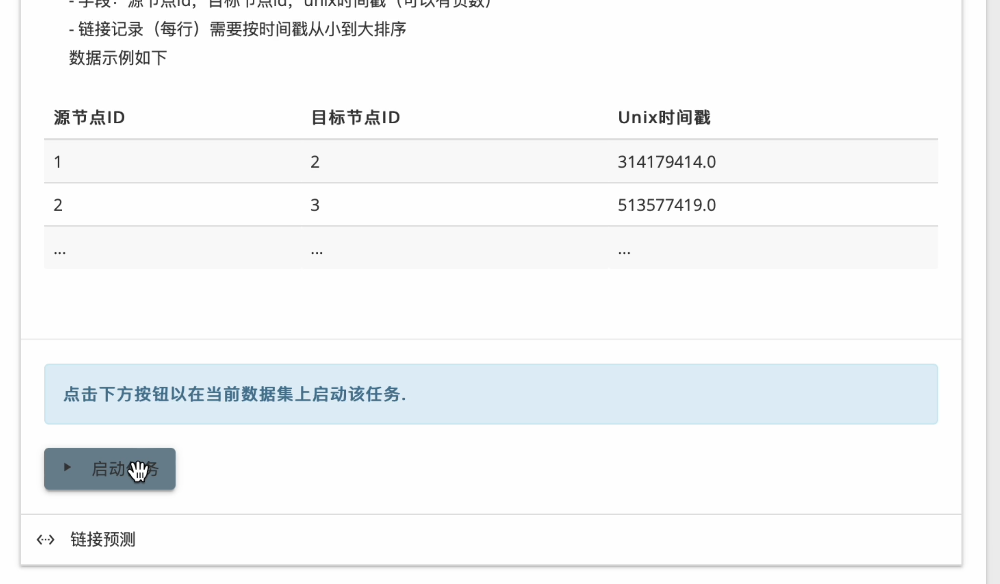

## 社交网络动态社区发现与分析系统

### 系统简介

本项目设计并实现了一个动态社区发现与分析系统。

动态社区发现是一个方兴未艾的学术问题，具有广泛的应用前景。其目标为在动态社交网络中寻找联系紧密的结构（如兴趣群组、学术团体等），并在时间维度上追踪。

系统采用Django框架搭建，前端使用Material风格的组件构建，可视化方面则使用了Echart组件库。

本项目包含

+ **动态社区及事件发现算法TILES的实现**
  来源：Rossetti, G., Pappalardo, L., Pedreschi, D., & Giannotti, F. (2017). Tiles: an online algorithm for community discovery in dynamic social networks[J]. Machine Learning, 106(8), 1213–1241. https://doi.org/10.1007/s10994-016-5582-8.
  官方实现：https://github.com/GiulioRossetti/TILES
+ **一个动态社区分析Web系统**
  该系统实现了上传数据、社交网络分析、结果查询的工作流，并用可视化组件展示所得社区

### 运行环境

注意：请使用依赖项的指定版本，否则可能导致未知错误

+ python 3.8.x
+ Mysql 8.x
+ Python依赖
  + django 4.0
  + networkx 2.3
  + pyMySQL 1.0.2
  + pytz 2022.1
  + future 0.18.2
  + tqdm 4.64.0
  + matplotlib 3.5.1
  + numpy 1.22.3
  + seaborn 0.11.2

### 初始化

1. 安装前述的依赖项
2. 在MySQL中新建一个数据库，库名可以根据需要设置
3. 在项目目录`SNA_BackEnd/settings.py`中修改`DATABASE`项，填入数据库名称、具有操作该库权限的一个用户的用户名和密码
4. 在项目目录下执行`python manage.py makemigrations`，然后执行`python manage.py migrate`以在数据库建立必要的表
5. 在项目目录下执行`python manage.py runserver`，即可启动系统，此时打开浏览器访问`127.0.0.1:8000`即可进入系统

### 使用说明

#### 用户端-数据集管理

数据集管理相关功能可以在系统主页完成，主页展示现有数据集，并提供新建数据集和上传数据文件的操作卡片，相关界面如下图所示。

在新建数据集操作区（如下图所示），点击文件图标以在本地选择一个数据文件作为新的数据集，在文本输入框中根据需求输入新数据集的名字，然后点击“提交”按钮，稍等片刻后页面会自动刷新，并可在上方现有数据集中看到新上传的数据集。

在系统主页中点击某个数据集，即进入到数据集详情页。该页面展示数据集基本信息、任务执行记录和任务执行区，如下图所示。

系统中的数据集分为公开和私有两类，该访问权限由数据集创建者设置。在公开数据集上，所有用户都能查看和提交任务；在私有数据集上，仅有创建者能够查看和提交新任务。数据集创建者和管理员用户可以随时更改数据集的访问权限。

#### 用户端-任务执行

在数据集详情页中，选择在该数据集上启动社区演化分析任务：在“社交网络分析任务”卡片中选择动态社区发现任务，则选单会展开并展示任务介绍和数据格式说明。

浏览任务介绍后，点击“启动”按钮，以启用相应后端分析算法，如下图所示。

“任务执行记录”列表中会展示历史任务和当前执行任务的任务名、调用算法、开始时间和执行状态等信息。执行状态为“执行中”、“已完成”、“出错”和“未知”中的一种。选定的任务启动后，刷新页面即可在任务执行记录中看到状态为“执行中”的新任务；执行中的任务以子进程的形式在后端运行，此时可以浏览系统的其他模块或关闭网页，而后台执行的任务并不会受到影响。

任务执行完毕后，对应记录的执行状态会自动变更为“已完成”，此时可以查看执行结果。若某记录的执行状态变为“出错”，则说明算法抛出异常，此时应当检查数据集格式是否符合要求。

#### 用户端-分析结果展示

任务完成后，任务执行记录中执行结果一栏自动变更为一个“查看结果”按钮，如下图所示。

点击该按钮即可以图表的形式查看当前数据集中的网络演化趋势，即每一观测点的活跃社区数量、四类演化时间点的数量，及其在时序上的变化，如下图所示。

此卡片提供交互式的浏览，用户可以单独设置每个类别的可见性，查看每个时间点的具体数值，甚至下载图表到本地。

系统还提供更细粒度的分析信息，即动态社区内部结构的浏览。在任务详情页的“代表性社区”卡片中，可以看到动态网络中的若干社区，点击可以查看该社区的详细情况。

这里可以浏览某个动态社区在生存期内的每个时间区间内的内部结构、统计特征和每个成员的影响力大小，可视化面板会形象地将影响力更大的节点用更大的尺寸画出。

#### 管理员端操作

系统管理员端由Django框架内建的admin模块扩展而来，主要功能为用户管理与数据管理。以Dataset数据记录为例，在左侧列表中选择SNA应用下的Dataset模型，即可看到所有已在数据库中持久化的Dataset记录，如下图所示。

可以点击右上角加号按钮添加记录，也可以点击某条数据记录查看其具体字段，如下图所示。

该页面支持以各个字段匹配的方式修改字段的内容并提交到数据库，若需批量操作，亦可通过定制admin模型和视图实现。

用户与用户组管理也可在此面板中操作，在左侧列表中选择权限与认证管理，选择用户管理，即可看到此时系统中已注册的用户，及其权限，如下图所示。

点击某个用户，进入其详情页，若此时使用的管理员具有相应权限，则可查看该用户的登录历史，可修改其用户组，并按用户或用户组详细地调整其管理权限，如下图所示。

### 代码目录结构

+ SNA/：应用实现
  + algorithms/：社交网络分析算法实现、数据处理脚本、结果解析脚本等
    + tiles/：TILES算法实现
    + parse/：解析脚本
  + model.py：数据模型实现
  + views.py：视图实现
  + templates/：HTML模板
  + urls.py：应用级别路由
+ SNA_BackEnd/：项目级别配置文件，如系统配置项、项目级别路由等
+ static/：静态文件存储目录，存放系统中展示的图片、嵌入的js代码、CSS等
